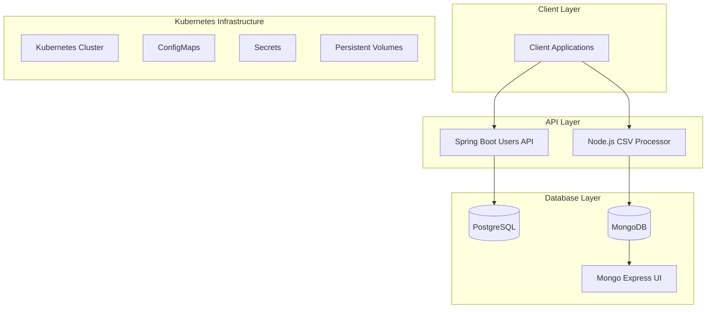

# EBITWARE Project Setup

Microservices architecture project consisting of a Spring Boot Users API and a Node.js CSV Processor.

## Architecture Overview



## Project Structure

```
EBITWARE/
├── java/
│   └── bitware/              # Spring Boot Users API
│       ├── kubernetes/       # K8s configurations
│       ├── src/             # Source code
│       ├── Dockerfile
│       └── deploy.sh
├── js/
│   └── csv-processor/       # Node.js CSV Processor
│       ├── kubernetes/      # K8s configurations
│       ├── src/            # Source code
│       ├── Dockerfile
│       └── deploy.sh
└── mongo/
    └── docker-compose.yml   # Local MongoDB setup
```

## Components

### 1. Users API (Spring Boot)
- REST API for user management
- PostgreSQL database
- Swagger UI for API documentation
- Kubernetes deployment ready

### 2. CSV Processor (Node.js)
- CSV file processing service
- MongoDB for data storage
- Mongo Express UI for database management
- Kubernetes deployment ready

## Prerequisites

- Java 11+
- Node.js 14+
- Docker
- Kubernetes cluster (or Minikube/Docker Desktop)
- kubectl CLI
- Maven
- npm/yarn

## Quick Start

1. Start local development environment:
```bash
# Start MongoDB
cd mongo
docker-compose up -d

# Deploy Users API
cd ../java/bitware
./deploy.sh

# Deploy CSV Processor
cd ../../js/csv-processor
./deploy.sh
```

2. Verify deployments:
```bash
# Check all pods
kubectl get pods -A

# Check services
kubectl get services -A
```

## Available Services

### Users API
- API Endpoint: http://localhost:30080/api/usuarios
- Swagger UI: http://localhost:30080/swagger-ui.html
- Actuator: http://localhost:30080/actuator

### CSV Processor
- Service Port: 3000
- Mongo Express UI: http://localhost:30081
  - Username: admin
  - Password: pass

## Development

### Users API
```bash
cd java/bitware
mvn spring-boot:run
```

### CSV Processor
```bash
cd js/csv-processor
npm install
npm run dev
```

## Deployment

Each service can be deployed independently:

```bash
# Deploy Users API
cd java/bitware
./deploy.sh

# Deploy CSV Processor
cd js/csv-processor
./deploy.sh
```

## Kubernetes Resources

### Users API
- Deployment
- Service (NodePort)
- ConfigMap
- Secrets
- PersistentVolumeClaim
- HorizontalPodAutoscaler

### CSV Processor
- Deployment
- Service
- ConfigMap
- Secrets
- PersistentVolumeClaim

## Database Access

### PostgreSQL
```bash
kubectl exec -it -n users-api deployment/postgres -- psql -U postgres -d sales_db
```

### MongoDB
Access via Mongo Express UI: http://localhost:30081

## Monitoring

### Users API
```bash
kubectl logs -n users-api -l app=users-api
```

### CSV Processor
```bash
kubectl logs -n csv-processor -l app=csv-processor
```

## Cleanup

Remove all resources:
```bash
# Clean Users API
kubectl delete namespace users-api

# Clean CSV Processor
kubectl delete namespace csv-processor

# Stop local MongoDB
cd mongo
docker-compose down
```

## Testing

### Users API
```bash
cd java/bitware
mvn test
```

### CSV Processor
```bash
cd js/csv-processor
npm test
```

## Documentation

- Users API Documentation: http://localhost:30080/swagger-ui.html
- Project Documentation: `./docs`

## Contributing

1. Fork the repository
2. Create a feature branch
3. Commit changes
4. Push to the branch
5. Create a Pull Request

