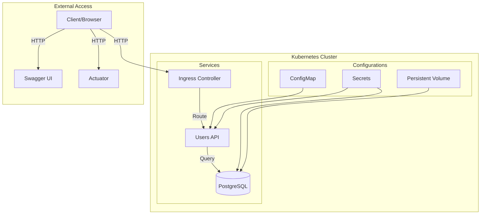

# Users API

A Spring Boot REST API for user management with PostgreSQL database.

## Architecture



## Tech Stack
- Java 11
- Spring Boot
- PostgreSQL
- Docker
- Kubernetes

## Project Structure
```
users-api/
├── src/
│   └── main/
│       ├── java/
│       │   └── com/
│       │       └── ebitware/
│       │           └── users/
│       └── resources/
│           ├── db/migration/
│           └── application.properties
├── kubernetes/
│   ├── postgres/
│   └── app/
├── deploy.sh
├── Dockerfile
└── pom.xml
```

## Prerequisites
- JDK 11
- Maven
- Docker
- Kubernetes cluster
- kubectl CLI

## Installation

1. Clone the repository
```bash
git clone [repository-url]
cd users-api
```

2. Build the project
```bash
mvn clean package
```

## Database Migration

The application uses Flyway for database migrations. Migration files are located in:
```
src/main/resources/db/migration/
```

## API Endpoints

| Method | URL | Description |
|--------|-----|-------------|
| GET | /api/usuarios | Get all users |
| GET | /api/usuarios/{id} | Get user by ID |
| POST | /api/usuarios | Create new user |
| PUT | /api/usuarios/{id} | Update user |
| DELETE | /api/usuarios/{id} | Delete user |

## Deployment

1. Deploy to Kubernetes:
```bash
# Build Docker image
docker build -t users-api:latest .

# Deploy application
./deploy.sh
```

2. Verify deployment:
```bash
kubectl get pods -n users-api
```

## Access Services

- API: http://localhost:30080/api/usuarios
- Swagger UI: http://localhost:30080/swagger-ui.html
- Actuator: http://localhost:30080/actuator

## Monitoring

View application logs:
```bash
kubectl logs -n users-api -l app=users-api
```

## Database Access

Connect to PostgreSQL:
```bash
kubectl exec -it -n users-api deployment/postgres -- psql -U postgres -d sales_db
```

## Cleanup

Remove all resources:
```bash
kubectl delete namespace users-api
```

## Configuration

The application can be configured via:
1. application.properties
2. Environment variables
3. Kubernetes ConfigMap

## Health Checks

Health endpoints available at:
- Readiness: http://localhost:30080/actuator/health/readiness
- Liveness: http://localhost:30080/actuator/health/liveness

## Monitoring Metrics

Metrics available at:
- http://localhost:30080/actuator/metrics
- http://localhost:30080/actuator/prometheus